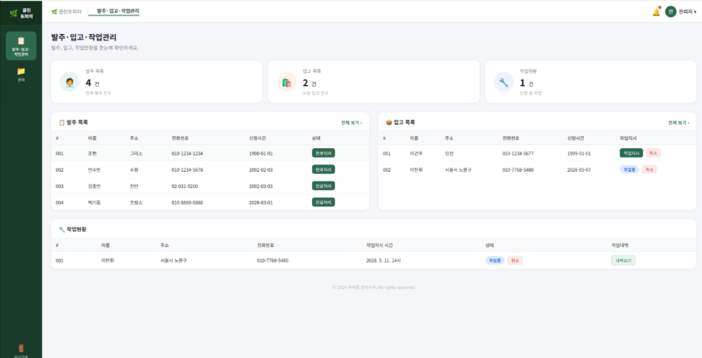
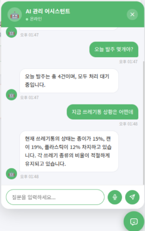

# Rokey Cobot Project 2


This project is an automated recycling system built with a collaborative robot and vision AI. A RealSense RGB-D camera detects objects, YOLO-based object detection results are converted into the robot coordinate system, and a Doosan collaborative robot picks up each object and moves it to the appropriate sorting location. The system is also connected to a web/Firebase interface to monitor the start condition, emergency stop, trash bin status, CCTV state, and task completion state.

## Project Overview

- Detects recyclable objects from camera images.
- Calculates each object's position and pose, then converts them into robot-graspable coordinates.
- Adjusts the gripping pose by considering both the planar angle and the Z-axis tilt.
- Uses vision to check whether an object contains water and estimates the water level.
- Supports voice commands for pausing, resuming, and selecting target objects.
- Manages robot status, CCTV status, trash-bin fullness, and workflow through a Firebase-based web interface.

## System Architecture


## Flow Charts

| Web Flow | Robot Flow | Exception Handling Flow |
| --- | --- | --- |
|  |  |  |

## Demo Video

[Watch the final demo video](<resource/img/최종 영상.mp4>)

## Key Features

### Web Dashboard

The web dashboard provides the main monitoring page for robot state, recycling-bin status, CCTV streams, notifications, and production workflow.



### AI Management Assistant

The web interface includes an AI-based management assistant that helps operators check system status, review alerts, and support administrative decisions from the dashboard.



### Voice Control

Voice commands can pause or resume robot operation and select specific sorting targets.

### Z Tilting Grip

The system calculates both the object's planar rotation angle and Z-axis tilt angle, then grips the object according to its pose.


### Water Detection

The system determines whether an object contains water and estimates the water level in stages.

| Water O | Water X |
| --- | --- |
|  |  |

| 0% | 25% | 50% | 75% |
| --- | --- | --- | --- |
|  |  |  |  |

## Tech Stack

- **Robot**: Doosan M0609 collaborative robot, OnRobot RG gripper
- **Vision**: Intel RealSense RGB-D Camera, OpenCV, YOLO
- **Robot Middleware**: ROS 2, Doosan Robotics ROS 2 package
- **Backend / Control**: Python, Firebase Firestore
- **Web / Streaming**: Firebase Web SDK, PeerJS, Flask, browser camera streaming
- **Auxiliary Features**: STT voice commands, emergency stop, trash bin fullness detection, CCTV human detection

## Repository Structure

```text
.
├── cobot2/          # ROS 2 package: robot control, vision, coordinate conversion, Firebase bridge
├── resource/        # Calibration data, class labels, demo media, architecture/flowchart images
├── sender/          # CCTV/browser camera sender pages and robot-side Flask frame receiver
├── test/            # ROS 2 package tests
├── web/             # Firebase-based web dashboard and admin/production pages
├── package.xml      # ROS 2 package metadata
└── setup.py         # Python package setup and ROS 2 console entry points
```

### Folder Responsibilities

- `cobot2/`: Main robot and vision code. This includes RealSense camera handling, YOLO prediction, robot motion, gripper control, coordinate conversion, and Firebase state synchronization.
- `web/`: Browser UI for login, admin dashboard, production log management, trash-bin status, robot status, notifications, and CCTV monitoring.
- `sender/`: Camera sender and CCTV pages. `camera_stream.html` streams browser camera frames to the local robot-side Flask server, while `CCTV1.html` and `CCTV2.html` expose PeerJS video streams for the web dashboard.
- `resource/`: Runtime assets and documentation media such as calibration matrices, class names, flow charts, demo images, GIFs, and video.
- `test/`: Basic ROS 2 package quality tests.

### Web and Camera Flow

1. Open `web/index.html` and sign in with the admin account used by the demo UI.
2. Use `web/admin.html`, `web/production.html`, and `web/gwanri.html` to monitor robot status, work logs, bin fullness, and CCTV streams.
3. Open the camera sender page in `sender/` on the camera device or browser.
4. Run the robot-side receiver script when frame capture is needed. `sender/test_retain.py` exposes `/capture_ready` and `/upload_frame` through Flask on port `5050`, and `sender/camera_stream.html` posts captured frames to that server.

## Structure Notes

- Keeping `web/` separate from `sender/` is a good direction because the dashboard and camera sender have different responsibilities and runtime locations.
- Prefer lowercase directory names such as `web/` for consistency across operating systems and deployment targets.
- Rename temporary or unclear scripts, such as `sender/adsfasfdsafsd.py`, once their final role is decided.
- Firebase configuration is currently embedded in browser files. Before public deployment, review Firestore security rules and move sensitive server-side credentials out of the client.

## Note

This project was developed using a real collaborative robot, gripper, RGB-D camera, and Firebase environment.
