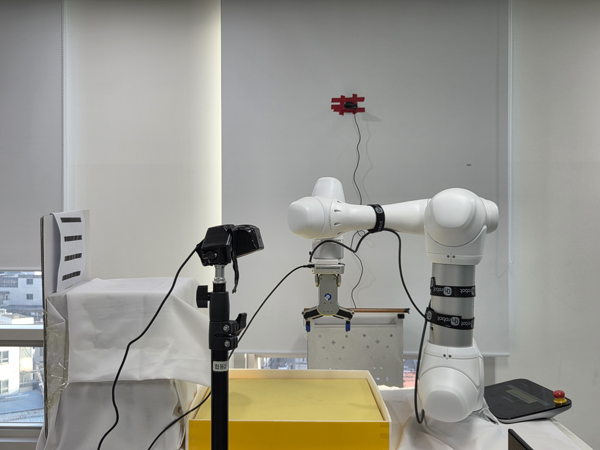
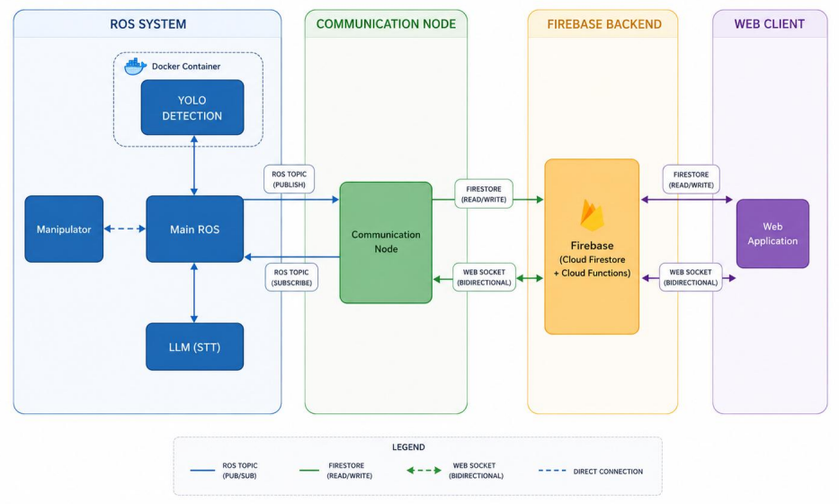
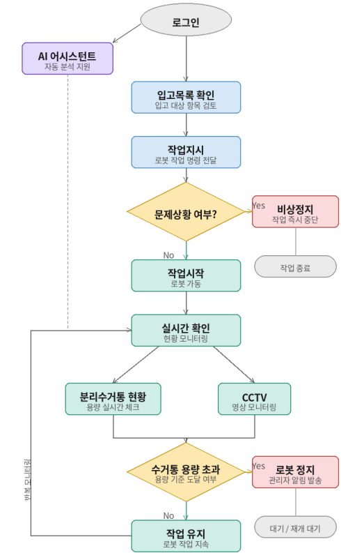
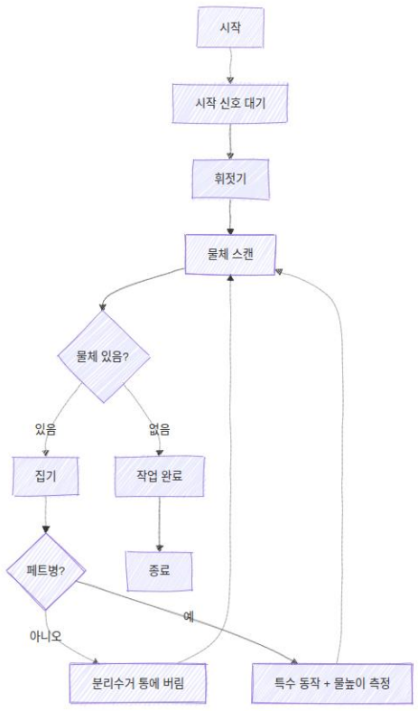
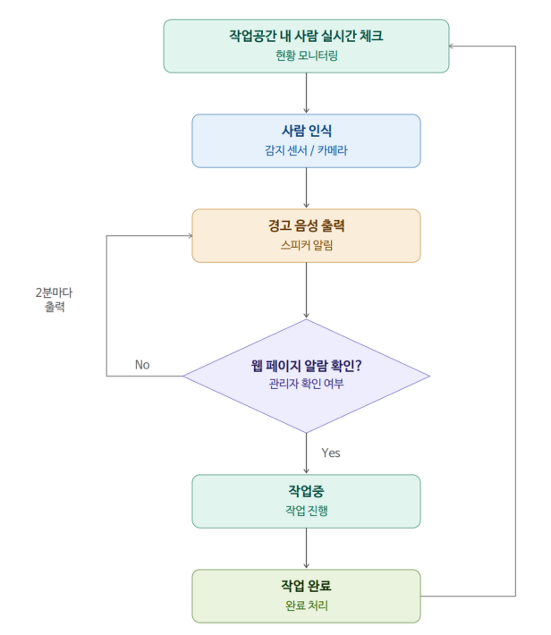
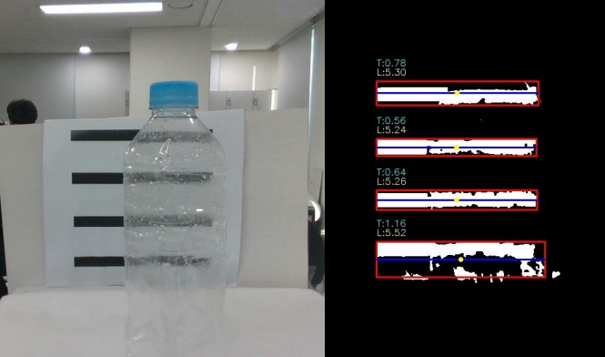
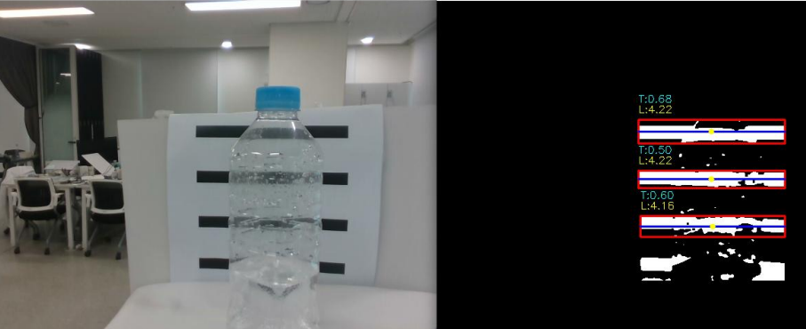
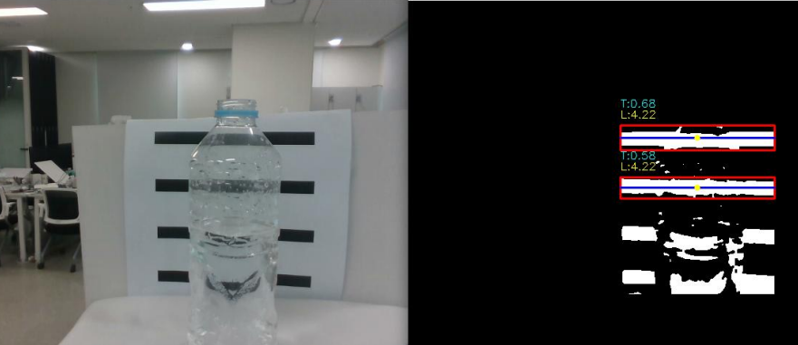
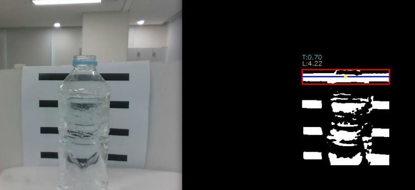

# Rokey Cobot Project 2



This project is an automated recycling system built with a collaborative robot and vision AI. A RealSense RGB-D camera detects objects, YOLO-based object detection results are converted into the robot coordinate system, and a Doosan collaborative robot picks up each object and moves it to the appropriate sorting location. The system is also connected to a web/Firebase interface to monitor the start condition, emergency stop, trash bin status, and task completion state.

## Project Overview

- Detects recyclable objects from camera images.
- Calculates each object's position and pose, then converts them into robot-graspable coordinates.
- Adjusts the gripping pose by considering both the planar angle and the Z-axis tilt.
- Uses vision to check whether an object contains water and estimates the water level.
- Supports voice commands for pausing, resuming, and selecting target objects.
- Manages robot status and workflow through a Firebase-based web interface.

## System Architecture



## Flow Charts

| Web Flow | Robot Flow | Exception Handling Flow |
| --- | --- | --- |
|  |  |  |

## Demo Video

[Watch the final demo video](<resource/img/최종 영상.mp4>)

## Key Features

### Voice Control

Voice commands can pause or resume robot operation and select specific sorting targets.

### Z Tilting Grip

The system calculates both the object's planar rotation angle and Z-axis tilt angle, then grips the object according to its pose.


### Water Detection

The system determines whether an object contains water and estimates the water level in stages.

| Water O | Water X |
| --- | --- |
|  |  |

| 0% | 25% | 50% | 75% |
| --- | --- | --- | --- |
|  |  |  |  |

## Tech Stack

- **Robot**: Doosan M0609 collaborative robot, OnRobot RG gripper
- **Vision**: Intel RealSense RGB-D Camera, OpenCV, YOLO
- **Robot Middleware**: ROS 2, Doosan Robotics ROS 2 package
- **Backend / Control**: Python, Firebase Firestore
- **Auxiliary Features**: STT voice commands, emergency stop, trash bin fullness detection

## Repository Structure

```text
.
├── cobot2/       # Robot control, object detection, coordinate conversion, and Firebase integration
├── resource/     # Calibration data, class information, images, and video assets
├── test/         # ROS 2 package tests
├── package.xml   # ROS 2 package metadata
└── setup.py      # Python package setup
```

## Note

This project was developed using a real collaborative robot, gripper, RGB-D camera, and Firebase environment.
